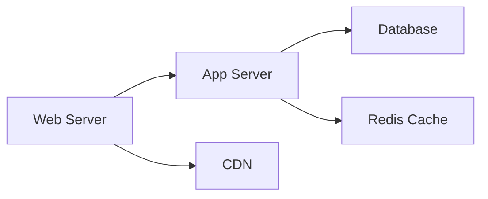
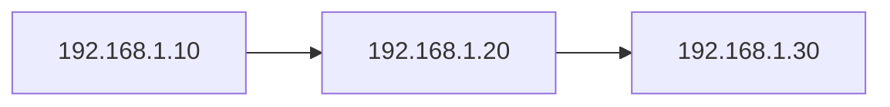

# Illumio-Style Network Segmentation Features

SimpleInfra now includes advanced network segmentation capabilities inspired by Illumio, providing micro-segmentation, zero-trust networking, and automated policy management.

## Table of Contents

1. [Overview](#overview)
2. [Policy Engine](#policy-engine)
3. [Application Dependency Mapping](#application-dependency-mapping)
4. [Traffic Flow Analysis](#traffic-flow-analysis)
5. [Complete Workflow](#complete-workflow)
6. [Best Practices](#best-practices)

---

## Overview

The Illumio-style features provide three complementary capabilities:

- **Policy Engine**: Template-based policy management with label-based segmentation
- **Application Dependency Mapping**: Automatic service discovery and dependency visualization
- **Traffic Flow Analysis**: Real-time monitoring, baseline learning, and anomaly detection

These features work together to enable:
- **Micro-segmentation**: Fine-grained network isolation between services
- **Zero-trust networking**: Default-deny policies with explicit allow rules
- **Compliance automation**: Pre-configured templates for PCI-DSS, HIPAA, NIST
- **Automated policy generation**: Recommendations based on observed traffic
- **Service discovery**: Automatic mapping of application dependencies

---

## Policy Engine

### DSL Syntax

```
policy:
    action "<action>"
    <parameters>
```

### Available Actions

#### 1. Apply Template

Apply pre-configured policy templates for common scenarios:

```
task "Setup Web Server" on web:
    policy:
        action "apply_template"
        template "web-tier"
        labels "role:web,tier:frontend,env:prod"
```

**Available Templates:**

| Template | Description | Use Case |
|----------|-------------|----------|
| `web-tier` | Public-facing web servers | HTTP/HTTPS services |
| `app-tier` | Application/API servers | Backend services |
| `database-tier` | Database servers | Data storage |
| `pci-compliant` | PCI-DSS compliant zone | Payment processing |
| `zero-trust-app` | Zero-trust application | High-security apps |

#### 2. Create Policy from Labels

Create custom policies using label-based selectors:

```
task "Allow Web to App" on web:
    policy:
        action "create_from_labels"
        source_labels "role:web"
        destination_labels "role:app"
        ports "8080,8443"
        protocol "tcp"
        description "API communication"
```

**Label Format:** `key:value` pairs separated by commas

**Common Labels:**
- `role:web`, `role:app`, `role:database`
- `tier:frontend`, `tier:backend`, `tier:data`
- `env:prod`, `env:staging`, `env:dev`
- `compliance:pci-dss`, `compliance:hipaa`
- `data:sensitive`, `data:cardholder`, `data:phi`

#### 3. Simulate Policy

Test policies before enforcement:

```
task "Test Zero Trust" on app:
    policy:
        action "simulate"
        template "zero-trust-app"
        duration "600"
        report "/tmp/simulation-results.json"
```

**Parameters:**
- `template`: Template to simulate
- `duration`: Simulation duration in seconds
- `report`: Output file for results

**Output includes:**
- Connections that would be allowed
- Connections that would be blocked
- Impact assessment

#### 4. Recommend Policies

Generate policy recommendations from traffic analysis:

```
task "Get Recommendations" on app:
    policy:
        action "recommend"
        duration "900"
        min_frequency "5"
        output "/tmp/recommendations.json"
```

**Parameters:**
- `duration`: Observation period in seconds
- `min_frequency`: Minimum connection count to recommend
- `output`: Recommendations file

**Output format:**
```json
{
  "recommendations": [
    {
      "source_ip": "192.168.1.10",
      "destination_ip": "192.168.1.20",
      "port": "8080",
      "protocol": "tcp",
      "frequency": 142,
      "suggested_labels": "role:web -> role:app",
      "confidence": "high"
    }
  ]
}
```

#### 5. Apply Compliance Template

Apply compliance framework templates:

```
task "PCI Compliance" on db:
    policy:
        action "apply_compliance"
        framework "pci-dss"
        cardholder_zone "true"
        logging "all"
```

**Supported Frameworks:**

| Framework | Description | Key Features |
|-----------|-------------|--------------|
| `pci-dss` | PCI Data Security Standard | Cardholder data protection, encryption, logging |
| `hipaa` | Health Insurance Portability | PHI protection, audit trails, access controls |
| `nist` | NIST Cybersecurity Framework | Defense in depth, least privilege, monitoring |

#### 6. Export Policy

Backup policies to JSON:

```
task "Backup Policies" on web:
    policy:
        action "export_policy"
        output "/tmp/web-policies.json"
```

#### 7. Import Policy

Restore or deploy policies from file:

```
task "Restore Policies" on web:
    policy:
        action "import_policy"
        policy_file "/tmp/web-policies.json"
        merge "true"
```

**Parameters:**
- `policy_file`: Path to policy JSON file
- `merge`: `"true"` to merge with existing, `"false"` to replace

---

## Application Dependency Mapping

### DSL Syntax

```
appdep:
    action "<action>"
    <parameters>
```

### Available Actions

#### 1. Discover Services

Auto-discover all running services:

```
task "Discover Services" on app:
    appdep:
        action "discover"
        output "/tmp/services.json"
```

**Detects:**
- Listening ports and processes
- Service types (HTTP, MySQL, PostgreSQL, Redis, etc.)
- Process owners and command lines

**Output format:**
```json
{
  "services": [
    {
      "port": "8080",
      "protocol": "tcp",
      "process": "java",
      "service_type": "http",
      "pid": "1234",
      "user": "appuser"
    }
  ]
}
```

#### 2. Map Dependencies

Discover dependencies between services:

```
task "Map Dependencies" on app:
    appdep:
        action "map_dependencies"
        duration "300"
        output "/tmp/dependencies.json"
```

**Parameters:**
- `duration`: Observation period in seconds
- `output`: Output file

**Analyzes:**
- Active connections between services
- Communication patterns
- Traffic volume
- Dependency frequency

#### 3. Create Application Group

Organize services into logical groups:

```
task "Create Web Stack" on web:
    appdep:
        action "create_app_group"
        group_name "web-stack"
        services "nginx,nodejs,redis"
        labels "tier:frontend,stack:web"
```

**Parameters:**
- `group_name`: Unique group identifier
- `services`: Comma-separated service list
- `labels`: Labels for the group

#### 4. Analyze Flows

Analyze traffic patterns between services:

```
task "Analyze Traffic" on app:
    appdep:
        action "analyze_flows"
        duration "600"
        min_connections "5"
        output "/tmp/flow-analysis.json"
```

**Parameters:**
- `duration`: Analysis period
- `min_connections`: Minimum connections to include
- `output`: Results file

#### 5. Generate Dependency Graph

Visualize service dependencies:

```
task "Generate Graph" on app:
    appdep:
        action "generate_graph"
        format "mermaid"
        output "/tmp/dependencies.mmd"
```

**Supported Formats:**

| Format | Description | Use Case |
|--------|-------------|----------|
| `json` | JSON graph structure | Programmatic processing |
| `dot` | Graphviz DOT format | Rendering with Graphviz |
| `mermaid` | Mermaid diagram | GitHub/documentation |

**Example Mermaid Output:**


---

## Traffic Flow Analysis

### DSL Syntax

```
flowanalysis:
    action "<action>"
    <parameters>
```

### Available Actions

#### 1. Monitor Flows

Real-time network flow monitoring:

```
task "Monitor Traffic" on app:
    flowanalysis:
        action "monitor"
        duration "120"
        interval "10"
```

**Parameters:**
- `duration`: Total monitoring duration (seconds)
- `interval`: Sampling interval (seconds)

**Captures:**
- Source/destination IPs and ports
- Connection states
- Protocol information
- Timestamps

**Output includes:**
- Total flows captured
- Unique sources and destinations
- Top talkers
- Port usage statistics

#### 2. Create Baseline

Learn normal traffic patterns:

```
task "Create Baseline" on app:
    flowanalysis:
        action "baseline"
        duration "300"
        name "app-baseline"
```

**Parameters:**
- `duration`: Learning period (longer = more accurate)
- `name`: Baseline identifier

**Captures:**
- Average flow volume
- Typical source IPs
- Typical destination IPs
- Common ports
- Normal traffic patterns

**Recommended durations:**
- Development: 300 seconds (5 minutes)
- Production: 1800+ seconds (30+ minutes)
- Critical systems: 3600+ seconds (1+ hour)

#### 3. Detect Anomalies

Compare current traffic against baseline:

```
task "Detect Anomalies" on app:
    flowanalysis:
        action "detect_anomalies"
        baseline "app-baseline"
        sensitivity "medium"
```

**Sensitivity Levels:**

| Level | Threshold Multiplier | Use Case |
|-------|---------------------|----------|
| `low` | 3.0x | Noisy environments |
| `medium` | 2.0x | Balanced detection |
| `high` | 1.5x | Strict monitoring |

**Detects:**
- **New source IPs**: Sources not in baseline
- **New top ports**: Unusual port usage
- **Traffic spikes**: Volume anomalies

**Anomaly Output:**
```json
{
  "anomalies": [
    {
      "type": "new_source_ips",
      "severity": "medium",
      "details": ["10.0.5.100", "10.0.5.101"],
      "description": "2 new source IPs not in baseline"
    },
    {
      "type": "traffic_spike",
      "severity": "high",
      "details": {
        "baseline": 45,
        "current": 120,
        "multiplier": 2.67
      },
      "description": "Traffic 2.7x higher than baseline"
    }
  ]
}
```

#### 4. Visualize Flows

Generate visual representations:

```
task "Visualize Flows" on app:
    flowanalysis:
        action "visualize"
        format "mermaid"
```

**Supported Formats:**

**ASCII** - Simple text visualization:
```
Flow Visualization:
============================================================

192.168.1.10:45678
  └─> 192.168.1.20:8080
  └─> 192.168.1.30:5432
  └─> 192.168.1.40:6379

192.168.1.20:56789
  └─> 192.168.1.30:5432
  ... and 5 more
```

**Mermaid** - Diagram format:


**JSON** - Structured data for external tools

#### 5. Identify Top Talkers

Find highest-traffic sources/destinations:

```
task "Top Talkers" on app:
    flowanalysis:
        action "top_talkers"
        duration "120"
        top "10"
```

**Parameters:**
- `duration`: Analysis period
- `top`: Number of top talkers to return

**Output:**
```json
{
  "top_sources": [
    {"ip": "192.168.1.10", "flow_count": 1523},
    {"ip": "192.168.1.50", "flow_count": 892}
  ],
  "top_destinations": [
    {"ip": "192.168.1.30", "flow_count": 2145},
    {"ip": "192.168.1.40", "flow_count": 1203}
  ]
}
```

---

## Complete Workflow

### 1. Discovery Phase

Understand your environment:

```
# Discover services
task "Discover All Services" on app:
    appdep action="discover" output="/tmp/services.json"

# Map dependencies
task "Map Dependencies" on app:
    appdep action="map_dependencies" duration="600" output="/tmp/deps.json"

# Generate visualization
task "Visualize Dependencies" on app:
    appdep action="generate_graph" format="mermaid" output="/tmp/graph.mmd"
```

### 2. Baseline Creation

Learn normal traffic patterns:

```
# Create baselines for each tier
task "Create Web Baseline" on web:
    flowanalysis action="baseline" duration="600" name="web-baseline"

task "Create App Baseline" on app:
    flowanalysis action="baseline" duration="600" name="app-baseline"

task "Create DB Baseline" on db:
    flowanalysis action="baseline" duration="900" name="db-baseline"
```

### 3. Policy Generation

Get automated recommendations:

```
# Analyze traffic and recommend policies
task "Get Policy Recommendations" on app:
    policy action="recommend" duration="900" output="/tmp/recommendations.json"
```

### 4. Policy Testing

Simulate before enforcement:

```
# Test policies in simulation mode
task "Simulate Web Policies" on web:
    policy:
        action "simulate"
        template "web-tier"
        duration "300"
        report "/tmp/web-sim.json"
```

### 5. Policy Deployment

Apply policies:

```
# Apply templates with labels
task "Deploy Web Policy" on web:
    policy:
        action "apply_template"
        template "web-tier"
        labels "role:web,tier:frontend,env:prod"

# Create custom inter-tier policies
task "Web to App Policy" on web:
    policy:
        action "create_from_labels"
        source_labels "role:web"
        destination_labels "role:app"
        ports "8080"
        protocol "tcp"
```

### 6. Compliance Hardening

Apply compliance frameworks:

```
# Apply PCI-DSS to cardholder environment
task "PCI Compliance" on db:
    policy:
        action "apply_compliance"
        framework "pci-dss"
        cardholder_zone "true"
        logging "all"
```

### 7. Continuous Monitoring

Monitor and detect anomalies:

```
# Real-time monitoring
task "Monitor Flows" on app:
    flowanalysis action="monitor" duration="300" interval="30"

# Anomaly detection
task "Detect Anomalies" on app:
    flowanalysis:
        action "detect_anomalies"
        baseline "app-baseline"
        sensitivity "medium"

# Identify suspicious traffic
task "Top Talkers" on app:
    flowanalysis action="top_talkers" duration="120" top="20"
```

### 8. Backup and Documentation

Export for disaster recovery:

```
# Export all policies
task "Backup Policies" on web:
    policy action="export_policy" output="/tmp/backup/web-policies.json"

# Generate dependency documentation
task "Document Dependencies" on app:
    appdep action="generate_graph" format="mermaid" output="/docs/dependencies.mmd"
```

---

## Best Practices

### Label Design

**Use hierarchical labeling:**
```
role:web              # Service role
tier:frontend         # Architecture tier
env:prod              # Environment
region:us-east-1      # Geographic location
compliance:pci-dss    # Compliance requirements
data:cardholder       # Data classification
```

**Naming conventions:**
- Use lowercase
- Use hyphens for multi-word values
- Be consistent across infrastructure
- Document label taxonomy

### Baseline Creation

**Timing:**
- Create baselines during normal operation
- Avoid special events (deployments, traffic spikes)
- Update baselines quarterly or after major changes

**Duration:**
- Minimum: 5 minutes (development)
- Recommended: 30 minutes (production)
- Critical systems: 1+ hours

### Policy Simulation

**Always simulate before enforcement:**
1. Run simulation for at least 10 minutes
2. Review blocked connections
3. Adjust policies if needed
4. Re-simulate until clean
5. Deploy to production

### Anomaly Detection

**Sensitivity selection:**
- Start with `medium` sensitivity
- Tune based on false positive rate
- Use `high` for critical systems after tuning
- Use `low` for development environments

### Dependency Mapping

**Observation periods:**
- Web tier: 5-10 minutes (high traffic)
- App tier: 10-30 minutes (moderate traffic)
- Database: 30+ minutes (variable connections)
- Batch systems: Hours or days (infrequent)

### Compliance

**Framework selection:**
- PCI-DSS: Payment card data
- HIPAA: Healthcare data (PHI)
- NIST: General security best practices

**Zoning:**
- Clearly mark data zones with labels
- Use `cardholder_zone="true"` for PCI scope
- Use `phi_zone="true"` for HIPAA scope
- Enable comprehensive logging

### Monitoring

**Continuous monitoring workflow:**
```
1. Monitor (real-time) → 2. Baseline (weekly) →
3. Detect anomalies (continuous) → 4. Review (daily) →
5. Update policies (as needed)
```

### Integration with Traditional Segmentation

Combine Illumio-style features with traditional modules:

```
# 1. Traditional VLAN segmentation
task "Create VLANs" on host:
    network action="vlan" vlan_id="100" interface="eth0" operation="create"

# 2. Illumio-style policy on VLAN
task "Apply VLAN Policy" on host:
    policy:
        action "apply_template"
        template "app-tier"
        labels "vlan:100,role:app"

# 3. Monitor the segmented network
task "Monitor VLAN Traffic" on host:
    flowanalysis action="monitor" duration="300" interval="30"
```

---

## Examples

See these example files for complete workflows:

- **[policy_templates.si](examples/policy_templates.si)** - Policy engine basics
- **[app_dependency_mapping.si](examples/app_dependency_mapping.si)** - Service discovery
- **[flow_analysis.si](examples/flow_analysis.si)** - Traffic monitoring
- **[illumio_complete.si](examples/illumio_complete.si)** - End-to-end workflow

---

## Python API

All modules can also be used directly via Python API:

```python
from simpleinfra.modules.network.policy_engine import PolicyEngineModule
from simpleinfra.modules.network.app_dependency import ApplicationDependencyModule
from simpleinfra.modules.network.flow_analysis import FlowAnalysisModule

# Apply policy template
result = await PolicyEngineModule().execute(
    connector=ssh_connector,
    context=execution_context,
    action="apply_template",
    template="web-tier",
    labels="role:web,tier:frontend"
)

# Discover services
result = await ApplicationDependencyModule().execute(
    connector=ssh_connector,
    context=execution_context,
    action="discover",
    output="/tmp/services.json"
)

# Monitor flows
result = await FlowAnalysisModule().execute(
    connector=ssh_connector,
    context=execution_context,
    action="monitor",
    duration=120,
    interval=10
)
```

---

## Comparison with Illumio

| Feature | Illumio | SimpleInfra |
|---------|---------|-------------|
| Policy Templates | ✅ | ✅ |
| Label-based Segmentation | ✅ | ✅ |
| Application Dependency Map | ✅ | ✅ |
| Traffic Flow Visualization | ✅ | ✅ |
| Compliance Templates | ✅ | ✅ |
| Policy Simulation | ✅ | ✅ |
| Automated Recommendations | ✅ | ✅ |
| Anomaly Detection | ✅ | ✅ |
| Agent-based | ✅ | ❌ (Agentless) |
| GUI | ✅ | ❌ (CLI/Code) |
| Multi-cloud | ✅ | ✅ |
| Price | $$$$$ | Free |

SimpleInfra provides Illumio-style capabilities using an **agentless, infrastructure-as-code** approach, making it ideal for DevOps teams who prefer declarative configuration over GUI-based management.
