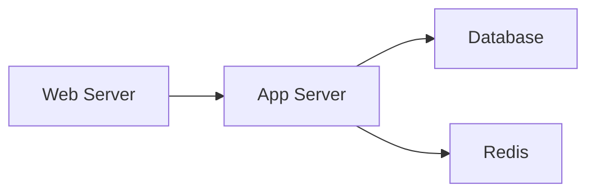

```markdown
# Network Modules Reference Guide

Complete documentation for all SimpleInfra network segmentation modules.

---

## Module Overview

SimpleInfra provides **8 network modules** for comprehensive network segmentation:

| Module | Purpose | Use Case |
|--------|---------|----------|
| **NetworkSegmentationModule** | General-purpose segmentation | VLANs, zones, micro-segmentation |
| **NetworkAgentModule** | Agent deployment | Continuous monitoring |
| **DMZModule** | DMZ setup | Public-facing services |
| **MultiTenantModule** | Tenant isolation | SaaS, hosting providers |
| **ZeroTrustModule** | Zero-trust networking | High-security environments |
| **PolicyEngineModule** | Template-based policies | Illumio-style segmentation |
| **ApplicationDependencyModule** | Service discovery | Dependency mapping |
| **FlowAnalysisModule** | Traffic analysis | Anomaly detection |

---

## 1. NetworkSegmentationModule

**File:** `modules/network/segmentation.py`

General-purpose network segmentation for all common scenarios.

### Actions

#### `isolate` - Network Isolation

Create isolated network zones with firewall rules.

```simpleinfra
task "Isolate DMZ" on server:
    network:
        action "isolate"
        zone "dmz"
        allowed_ips ["192.168.1.0/24"]
        allowed_ports ["80", "443", "22"]
        default_policy "deny"
```

**Parameters:**
- `zone` (string) - Zone name
- `allowed_ips` (list) - IP addresses/subnets to allow
- `allowed_ports` (list) - Ports to allow (strings or numbers)
- `default_policy` (string) - "deny" or "allow" (default: deny)

**What it does:**
- Detects firewall system (UFW or iptables)
- Creates default-deny rules
- Allows only specified IPs and ports
- Saves rules persistently

#### `vlan` - VLAN Management

Create and manage 802.1Q VLANs.

```simpleinfra
task "Create VLAN" on switch:
    network:
        action "vlan"
        vlan_id "100"
        interface "eth0"
        ip_address "10.0.100.1"
        netmask "255.255.255.0"
        operation "create"
```

**Parameters:**
- `vlan_id` (string) - VLAN ID (1-4094)
- `interface` (string) - Physical interface (default: "eth0")
- `ip_address` (string, optional) - IP for VLAN interface
- `netmask` (string) - Subnet mask (default: "255.255.255.0")
- `operation` (string) - "create" or "delete"

**What it does:**
- Loads 8021q kernel module
- Creates VLAN interface (eth0.100)
- Assigns IP address if specified
- Brings interface up

#### `discover` - Network Discovery

Discover network topology and devices.

```simpleinfra
task "Map Network" on gateway:
    network:
        action "discover"
        subnet "192.168.0.0/16"
        scan_type "ping"
```

**Parameters:**
- `subnet` (string) - Network to scan (CIDR notation)
- `scan_type` (string) - "ping", "fast", or "full"

**Scan types:**
- `ping` - Quick ping sweep (alive hosts only)
- `fast` - Fast port scan on common ports
- `full` - Comprehensive scan with OS detection

**Returns:**
- Host count
- Full nmap output

#### `zone` - Firewall Zones

Create security zones using firewalld.

```simpleinfra
task "Create DMZ Zone" on firewall:
    network:
        action "zone"
        zone "dmz"
        interfaces ["eth0"]
        sources ["192.168.1.0/24"]
        services ["http", "https"]
        ports ["8080/tcp"]
```

**Parameters:**
- `zone` (string) - Zone name
- `interfaces` (list) - Network interfaces in zone
- `sources` (list) - Source IP ranges
- `services` (list) - Firewalld service names
- `ports` (list) - Additional ports (format: "port/protocol")

**What it does:**
- Installs firewalld if needed
- Creates named zone
- Associates interfaces and sources
- Allows specified services and ports

#### `microsegment` - Micro-Segmentation

Create precise host-to-host traffic rules.

```simpleinfra
task "Microsegment Services" on app:
    network:
        action "microsegment"
        from ["10.0.1.0/24"]
        to ["10.0.2.0/24"]
        ports ["8080", "8443"]
        protocol "tcp"
```

**Parameters:**
- `from` (list) - Source hosts/subnets
- `to` (list) - Destination hosts/subnets
- `ports` (list) - Allowed ports
- `protocol` (string) - "tcp" or "udp" (default: tcp)

**What it does:**
- Creates specific allow rules between hosts
- Applies default deny for other traffic
- Implements least-privilege access

#### `traffic_control` - Traffic Shaping

Control network traffic with QoS.

```simpleinfra
task "Limit Bandwidth" on router:
    network:
        action "traffic_control"
        interface "eth0"
        tc_action "limit"
        bandwidth "100mbit"
```

**Parameters:**
- `interface` (string) - Network interface
- `tc_action` (string) - "limit", "delay", "loss", or "remove"
- `bandwidth` (string) - Bandwidth limit (e.g., "100mbit")
- `delay` (string) - Network delay (e.g., "100ms")
- `packet_loss` (string) - Packet loss percentage (e.g., "0.1%")

**Actions:**
- `limit` - Bandwidth limiting
- `delay` - Add network latency (testing)
- `loss` - Simulate packet loss (testing)
- `remove` - Remove traffic control

---

## 2. NetworkAgentModule

**File:** `modules/network/agent.py`

Deploy and manage lightweight network monitoring agents.

### Actions

#### `deploy` - Deploy Agent

Deploy monitoring agent to remote host via SSH.

```simpleinfra
task "Deploy Monitor" on web:
    agent:
        action "deploy"
        zone "web-tier"
        interval "60"
        mode "daemon"
        actions ["monitor_connections", "check_firewall"]
```

**Parameters:**
- `zone` (string) - Zone name for organization
- `interval` (string) - Check interval in seconds
- `mode` (string) - "daemon" or "oneshot"
- `actions` (list) - Monitoring actions
- `coordinator` (string, optional) - Coordinator URL

**Monitoring actions:**
- `monitor_connections` - Track active connections
- `check_firewall` - Monitor firewall rules

**What it creates:**
- `/usr/local/bin/simpleinfra-agent` - Python script
- `/tmp/simpleinfra_agent_config.json` - Configuration
- `/etc/systemd/system/simpleinfra-agent.service` - systemd service
- `/tmp/simpleinfra_agent.log` - Log file

#### `remove` - Remove Agent

Remove deployed agent and return to agentless.

```simpleinfra
task "Cleanup" on servers:
    agent:
        action "remove"
```

**What it removes:**
- Agent script
- Configuration files
- systemd service
- Log files

#### `status` - Check Status

Check agent status and recent logs.

```simpleinfra
task "Check Agents" on servers:
    agent:
        action "status"
```

**Returns:**
- Running/stopped status
- Enabled/disabled status
- Recent logs (last 20 lines)
- Current configuration

#### `configure` - Update Configuration

Update agent configuration and restart.

```simpleinfra
task "Reconfigure Agent" on server:
    agent:
        action "configure"
        interval "30"
        actions ["monitor_connections"]
```

**Parameters:**
- `interval` (string) - New check interval
- `coordinator` (string) - Coordinator URL
- `zone` (string) - Zone name
- `actions` (list) - Monitoring actions

---

## 3. DMZModule

**File:** `modules/network/dmz.py`

Specialized module for DMZ (Demilitarized Zone) setup.

### Actions

#### `create` - Create DMZ

Create hardened DMZ zone with best practices.

```simpleinfra
task "Setup DMZ" on edge:
    dmz:
        action "create"
        zone "dmz"
        services ["http", "https"]
        management_ips ["10.0.0.0/24"]
        logging true
```

**Parameters:**
- `zone` (string) - DMZ zone name
- `services` (list) - Public services to allow
- `management_ips` (list) - Management network IPs
- `logging` (boolean) - Enable firewall logging

**Service names:**
- `http` - Port 80
- `https` - Port 443
- `smtp` - Port 25
- `dns` - Port 53
- `ftp` - Port 21

**What it implements:**
- Default deny inbound AND outbound
- Public services allowed from anywhere
- SSH only from management network
- DNS/HTTP/HTTPS outbound (for updates)
- Connection tracking
- Firewall logging

#### `harden` - Harden DMZ

Apply additional security hardening.

```simpleinfra
task "Harden DMZ" on edge:
    dmz:
        action "harden"
```

**What it adds:**
- SYN flood protection
- Port scan detection
- ICMP rate limiting
- Invalid packet dropping

#### `verify` - Verify DMZ

Verify DMZ configuration compliance.

```simpleinfra
task "Verify DMZ" on edge:
    dmz:
        action "verify"
```

**Checks:**
- Firewall is active
- Default policies are DROP
- Logging is enabled
- Required ports are open

**Returns:**
- Issues found (if any)
- Firewall type (ufw/iptables)
- Compliance status

---

## 4. MultiTenantModule

**File:** `modules/network/multitenant.py`

VLAN-based tenant isolation for multi-tenant environments.

### Actions

#### `create_tenant` - Create Tenant Network

Create isolated network for a tenant.

```simpleinfra
task "Create Tenant A" on host:
    multitenant:
        action "create_tenant"
        tenant_id "tenant-a"
        vlan_id "100"
        subnet "10.0.100.1/24"
        interface "eth0"
        bandwidth "100mbit"
```

**Parameters:**
- `tenant_id` (string) - Tenant identifier
- `vlan_id` (string) - VLAN ID for tenant
- `subnet` (string, optional) - IP subnet for tenant
- `interface` (string) - Physical interface
- `bandwidth` (string, optional) - Bandwidth limit

**What it does:**
- Creates dedicated VLAN
- Assigns subnet
- Blocks inter-tenant traffic
- Applies bandwidth limit
- Logs configuration to `/etc/simpleinfra-tenants.conf`

#### `isolate_tenants` - Isolate All Tenants

Ensure complete isolation between all tenants.

```simpleinfra
task "Isolate Tenants" on host:
    multitenant:
        action "isolate_tenants"
        interface "eth0"
```

**What it does:**
- Discovers all VLAN interfaces
- Creates firewall rules blocking inter-VLAN traffic
- Ensures zero cross-tenant communication

#### `set_bandwidth` - Set Bandwidth Limit

Set or update bandwidth limit for a tenant.

```simpleinfra
task "Update Bandwidth" on host:
    multitenant:
        action "set_bandwidth"
        tenant_id "tenant-a"
        vlan_id "100"
        bandwidth "200mbit"
```

**Parameters:**
- `tenant_id` (string) - Tenant identifier
- `vlan_id` (string) - VLAN ID
- `bandwidth` (string) - New bandwidth limit

#### `list_tenants` - List Tenants

List all configured tenants.

```simpleinfra
task "List Tenants" on host:
    multitenant:
        action "list_tenants"
```

**Returns:**
- Tenant configurations
- VLAN count
- Tenant details

---

## 5. ZeroTrustModule

**File:** `modules/network/zerotrust.py`

Zero-trust network architecture implementation.

### Actions

#### `enable` - Enable Zero-Trust

Enable zero-trust networking with default-deny-all.

```simpleinfra
task "Enable Zero Trust" on servers:
    zerotrust:
        action "enable"
        zone "zero-trust"
```

**What it does:**
- Sets default DROP on INPUT, FORWARD, OUTPUT
- Allows only loopback
- Drops invalid packets
- Enables comprehensive logging
- Allows established connections only

**Result:** All traffic denied by default. Must add explicit policies.

#### `add_policy` - Add Allow Policy

Add explicit allow policy for specific traffic.

```simpleinfra
task "Allow Web Access" on server:
    zerotrust:
        action "add_policy"
        service "web-access"
        source "10.0.1.0/24"
        destination "self"
        port "443"
        protocol "tcp"
```

**Parameters:**
- `service` (string) - Service name (for documentation)
- `source` (string) - Source IP/subnet
- `destination` (string) - "self" or destination IP
- `port` (string) - Port number
- `protocol` (string) - "tcp" or "udp"

**What it does:**
- Creates explicit allow rule
- Logs policy to `/etc/simpleinfra-zerotrust-policies.conf`
- Saves iptables rules

#### `verify` - Verify Zero-Trust

Verify zero-trust configuration.

```simpleinfra
task "Verify Zero Trust" on servers:
    zerotrust:
        action "verify"
```

**Checks:**
- Zero-trust is enabled
- Default policies are DROP
- Logging is configured
- Explicit policies exist

#### `audit` - Audit Dropped Traffic

Review and analyze dropped traffic.

```simpleinfra
task "Audit Traffic" on server:
    zerotrust:
        action "audit"
        lines "100"
```

**Parameters:**
- `lines` (string) - Number of log lines to analyze

**Returns:**
- Dropped packet count
- Top source IPs
- Top destination ports
- Recent drops

**Use case:** Identify traffic that may need policies.

---

## Module Comparison

| Feature | Segmentation | Agent | DMZ | MultiTenant | ZeroTrust |
|---------|-------------|-------|-----|-------------|-----------|
| **Purpose** | General | Monitoring | Public services | Tenant isolation | High security |
| **Complexity** | Medium | Low | Low | Medium | High |
| **Use case** | Most scenarios | Continuous monitoring | Edge servers | SaaS platforms | Critical systems |
| **Agent required** | No | Yes (optional) | No | No | No |
| **Firewall** | UFW/iptables | N/A | UFW/iptables | iptables | iptables |
| **Learning curve** | Easy | Easy | Easy | Medium | Hard |

---

## Usage Patterns

### Pattern 1: Simple Isolation

```simpleinfra
task "Isolate Web Tier" on web:
    network:
        action "isolate"
        zone "web"
        allowed_ports ["80", "443"]
```

**When to use:** Basic network isolation

### Pattern 2: DMZ Setup

```simpleinfra
task "Setup DMZ" on edge:
    dmz:
        action "create"
        services ["http", "https"]
        management_ips ["10.0.0.0/8"]
```

**When to use:** Public-facing services

### Pattern 3: Multi-Tenant

```simpleinfra
task "Create Tenants" on host:
    multitenant action="create_tenant" tenant_id="tenant-a" vlan_id="100"
    multitenant action="create_tenant" tenant_id="tenant-b" vlan_id="200"
    multitenant action="isolate_tenants"
```

**When to use:** SaaS platforms, hosting providers

### Pattern 4: Zero-Trust

```simpleinfra
task "Zero Trust Setup" on app:
    zerotrust action="enable"
    zerotrust:
        action "add_policy"
        service "api-access"
        source "10.0.1.0/24"
        port "8080"
```

**When to use:** High-security environments, compliance

### Pattern 5: With Monitoring

```simpleinfra
task "Segment and Monitor" on servers:
    network action="isolate" zone="app"
    agent:
        action "deploy"
        zone "app"
        interval "60"
```

**When to use:** Production environments requiring continuous monitoring

---

## Best Practices

### 1. Start Simple

```simpleinfra
# ✅ Good - start with basic isolation
network action="isolate" zone="web"

# ❌ Bad - don't start with complex zero-trust
zerotrust action="enable"  # Only for high-security needs
```

### 2. Use DMZ Module for Edge

```simpleinfra
# ✅ Good - use DMZ module for public services
dmz:
    action "create"
    services ["http", "https"]

# ❌ Avoid - manual firewall rules for DMZ
network action="isolate"  # Less secure
```

### 3. Isolate Tenants Properly

```simpleinfra
# ✅ Good - create tenants then isolate
multitenant action="create_tenant" tenant_id="a" vlan_id="100"
multitenant action="create_tenant" tenant_id="b" vlan_id="200"
multitenant action="isolate_tenants"

# ❌ Bad - forget to isolate
multitenant action="create_tenant"  # Tenants can talk!
```

### 4. Deploy Agents Only When Needed

```simpleinfra
# ✅ Good - configure first, monitor later
network action="isolate" zone="web"
# ... test ...
agent action="deploy" zone="web"  # Only if monitoring needed

# ❌ Bad - deploy agents immediately
agent action="deploy"  # Unnecessary complexity
```

### 5. Verify Configurations

```simpleinfra
# ✅ Good - always verify
dmz action="create"
dmz action="verify"

# ❌ Bad - skip verification
dmz action="create"  # Hope it works!
```

---

## Troubleshooting

### Issue: Firewall rules not applying

**Check firewall system:**
```simpleinfra
task "Debug" on server:
    run "which ufw iptables firewall-cmd"
    run "systemctl status ufw firewalld iptables"
```

### Issue: VLAN not working

**Check VLAN support:**
```simpleinfra
task "Check VLAN" on server:
    run "lsmod | grep 8021q"
    run "modprobe 8021q"
    run "ip link show"
```

### Issue: Zero-trust too strict

**Check policies:**
```simpleinfra
task "List Policies" on server:
    run "cat /etc/simpleinfra-zerotrust-policies.conf"
    run "iptables -L INPUT -n"
```

### Issue: Agent not starting

**Check agent:**
```simpleinfra
task "Debug Agent" on server:
    agent action="status"
    run "systemctl status simpleinfra-agent"
    run "cat /tmp/simpleinfra_agent.log"
```

---

## Advanced Topics

### Combining Modules

```simpleinfra
task "Complete Setup" on server:
    # 1. Create DMZ
    dmz action="create" services=["http", "https"]

    # 2. Harden it
    dmz action="harden"

    # 3. Deploy monitoring
    agent action="deploy" zone="dmz" interval="30"

    # 4. Verify
    dmz action="verify"
```

### Dynamic Policies

```simpleinfra
# Add policies dynamically based on discovered services
task "Dynamic ZeroTrust" on app:
    zerotrust action="enable"

    # Discover services
    network action="discover" subnet="10.0.0.0/24"

    # Add policies for each discovered service
    zerotrust action="add_policy" service="web" source="10.0.1.0/24" port="80"
    zerotrust action="add_policy" service="api" source="10.0.2.0/24" port="8080"
```

---

## 6. PolicyEngineModule

**File:** `modules/network/policy_engine.py`

Illumio-style policy management with templates, label-based segmentation, and compliance frameworks.

### Actions

#### `apply_template` - Apply Policy Template

Apply pre-configured policy templates for common scenarios.

**Parameters:**
- `template` (string) - Template name (web-tier, app-tier, database-tier, pci-compliant, zero-trust-app)
- `labels` (string) - Comma-separated labels (e.g., "role:web,tier:frontend")

**Available Templates:**
- **web-tier**: Public-facing web servers (HTTP/HTTPS)
- **app-tier**: Application/API servers
- **database-tier**: Database servers with strict access
- **pci-compliant**: PCI-DSS compliant cardholder environment
- **zero-trust-app**: Zero-trust application template

**Example:**
```simpleinfra
task "Setup Web Server" on web:
    policy:
        action "apply_template"
        template "web-tier"
        labels "role:web,tier:frontend,env:prod"
```

#### `create_from_labels` - Label-based Policy

Create custom policies using label selectors.

**Parameters:**
- `source_labels` (string) - Source service labels
- `destination_labels` (string) - Destination service labels
- `ports` (string) - Comma-separated ports
- `protocol` (string) - tcp/udp
- `description` (string) - Policy description

**Example:**
```simpleinfra
task "Allow Web to App" on web:
    policy:
        action "create_from_labels"
        source_labels "role:web"
        destination_labels "role:app"
        ports "8080,8443"
        protocol "tcp"
        description "API communication"
```

#### `simulate` - Test Policy

Simulate policy before enforcement.

**Parameters:**
- `template` (string) - Template to test
- `duration` (string) - Test duration in seconds
- `report` (string) - Output report path

**Example:**
```simpleinfra
task "Test Zero Trust" on app:
    policy:
        action "simulate"
        template "zero-trust-app"
        duration "600"
        report "/tmp/simulation.json"
```

#### `recommend` - Policy Recommendations

Generate policy recommendations from traffic analysis.

**Parameters:**
- `duration` (string) - Observation period (seconds)
- `min_frequency` (string) - Minimum connection count
- `output` (string) - Recommendations file

**Example:**
```simpleinfra
task "Get Recommendations" on app:
    policy:
        action "recommend"
        duration "900"
        min_frequency "5"
        output "/tmp/recommendations.json"
```

#### `apply_compliance` - Compliance Framework

Apply compliance framework templates.

**Parameters:**
- `framework` (string) - Framework name (pci-dss, hipaa, nist)
- `cardholder_zone` (string) - "true" for PCI scope
- `phi_zone` (string) - "true" for HIPAA scope
- `logging` (string) - Logging level (all, audit, minimal)

**Supported Frameworks:**
- **pci-dss**: PCI Data Security Standard
- **hipaa**: Health Insurance Portability
- **nist**: NIST Cybersecurity Framework

**Example:**
```simpleinfra
task "PCI Compliance" on db:
    policy:
        action "apply_compliance"
        framework "pci-dss"
        cardholder_zone "true"
        logging "all"
```

#### `export_policy` - Export Policies

Backup policies to JSON file.

**Parameters:**
- `output` (string) - Output file path

**Example:**
```simpleinfra
task "Backup Policies" on web:
    policy:
        action "export_policy"
        output "/tmp/web-policies.json"
```

#### `import_policy` - Import Policies

Restore policies from JSON file.

**Parameters:**
- `policy_file` (string) - Input policy file
- `merge` (string) - "true" to merge, "false" to replace

**Example:**
```simpleinfra
task "Restore Policies" on web:
    policy:
        action "import_policy"
        policy_file "/tmp/web-policies.json"
        merge "true"
```

---

## 7. ApplicationDependencyModule

**File:** `modules/network/app_dependency.py`

Automatic service discovery and application dependency mapping.

### Actions

#### `discover` - Discover Services

Auto-discover all running services on the system.

**Parameters:**
- `output` (string) - Output JSON file path

**Detects:**
- Listening ports and protocols
- Process names and PIDs
- Service types (HTTP, MySQL, PostgreSQL, Redis, etc.)
- Process owners

**Example:**
```simpleinfra
task "Discover Services" on app:
    appdep:
        action "discover"
        output "/tmp/services.json"
```

**Output Format:**
```json
{
  "services": [
    {
      "port": "8080",
      "protocol": "tcp",
      "process": "java",
      "service_type": "http",
      "pid": "1234",
      "user": "appuser"
    }
  ]
}
```

#### `map_dependencies` - Map Dependencies

Discover and map dependencies between services.

**Parameters:**
- `duration` (string) - Observation period (seconds)
- `output` (string) - Dependency map output file

**Example:**
```simpleinfra
task "Map Dependencies" on app:
    appdep:
        action "map_dependencies"
        duration "300"
        output "/tmp/dependencies.json"
```

#### `create_app_group` - Create Application Group

Organize services into logical application groups.

**Parameters:**
- `group_name` (string) - Unique group identifier
- `services` (string) - Comma-separated service list
- `labels` (string) - Group labels

**Example:**
```simpleinfra
task "Create Web Stack" on web:
    appdep:
        action "create_app_group"
        group_name "web-stack"
        services "nginx,nodejs,redis"
        labels "tier:frontend,stack:web"
```

#### `analyze_flows` - Analyze Traffic Flows

Analyze traffic patterns between services.

**Parameters:**
- `duration` (string) - Analysis period (seconds)
- `min_connections` (string) - Minimum connections to include
- `output` (string) - Analysis output file

**Example:**
```simpleinfra
task "Analyze Traffic" on app:
    appdep:
        action "analyze_flows"
        duration "600"
        min_connections "5"
        output "/tmp/flow-analysis.json"
```

#### `generate_graph` - Generate Dependency Graph

Create visual dependency graph.

**Parameters:**
- `format` (string) - Output format (json, dot, mermaid)
- `output` (string) - Output file path

**Supported Formats:**
- **json**: JSON graph structure
- **dot**: Graphviz DOT format
- **mermaid**: Mermaid diagram syntax

**Example:**
```simpleinfra
task "Generate Mermaid Graph" on app:
    appdep:
        action "generate_graph"
        format "mermaid"
        output "/tmp/dependencies.mmd"
```

**Mermaid Output Example:**


---

## 8. FlowAnalysisModule

**File:** `modules/network/flow_analysis.py`

Real-time traffic flow analysis, baseline learning, and anomaly detection.

### Actions

#### `monitor` - Monitor Network Flows

Real-time network flow monitoring.

**Parameters:**
- `duration` (string) - Total monitoring duration (seconds)
- `interval` (string) - Sampling interval (seconds)

**Captures:**
- Source/destination IPs and ports
- Connection states
- Protocol information
- Timestamps

**Example:**
```simpleinfra
task "Monitor Traffic" on app:
    flowanalysis:
        action "monitor"
        duration "120"
        interval "10"
```

**Output:**
```json
{
  "total_flows": 1523,
  "unique_sources": 12,
  "unique_destinations": 8,
  "top_sources": [["192.168.1.10", 456], ["192.168.1.20", 234]],
  "top_ports": [["8080", 892], ["443", 531]]
}
```

#### `baseline` - Create Traffic Baseline

Learn normal traffic patterns for anomaly detection.

**Parameters:**
- `duration` (string) - Learning period (seconds, longer is more accurate)
- `name` (string) - Baseline identifier

**Example:**
```simpleinfra
task "Create Baseline" on app:
    flowanalysis:
        action "baseline"
        duration "300"
        name "app-baseline"
```

**Recommended Durations:**
- Development: 300 seconds (5 minutes)
- Production: 1800 seconds (30 minutes)
- Critical: 3600+ seconds (1+ hour)

#### `detect_anomalies` - Detect Anomalies

Compare current traffic against baseline.

**Parameters:**
- `baseline` (string) - Baseline name to compare against
- `sensitivity` (string) - Detection sensitivity (low, medium, high)

**Sensitivity Levels:**
- **low** (3.0x threshold): Noisy environments
- **medium** (2.0x threshold): Balanced detection
- **high** (1.5x threshold): Strict monitoring

**Example:**
```simpleinfra
task "Detect Anomalies" on app:
    flowanalysis:
        action "detect_anomalies"
        baseline "app-baseline"
        sensitivity "medium"
```

**Detects:**
- New source IPs not in baseline
- Unusual port usage
- Traffic volume spikes

**Anomaly Output:**
```json
{
  "anomalies": [
    {
      "type": "new_source_ips",
      "severity": "medium",
      "details": ["10.0.5.100"],
      "description": "1 new source IP not in baseline"
    },
    {
      "type": "traffic_spike",
      "severity": "high",
      "details": {"baseline": 45, "current": 120, "multiplier": 2.67}
    }
  ]
}
```

#### `visualize` - Visualize Flows

Generate visual representations of traffic flows.

**Parameters:**
- `format` (string) - Visualization format (ascii, mermaid, json)

**Formats:**
- **ascii**: Simple text visualization
- **mermaid**: Diagram syntax for documentation
- **json**: Structured data for external tools

**Example:**
```simpleinfra
task "Visualize Flows" on app:
    flowanalysis:
        action "visualize"
        format "mermaid"
```

**ASCII Output Example:**
```
Flow Visualization:
============================================================

192.168.1.10:45678
  └─> 192.168.1.20:8080
  └─> 192.168.1.30:5432

192.168.1.20:56789
  └─> 192.168.1.30:5432
```

#### `top_talkers` - Identify Top Talkers

Find highest-traffic sources and destinations.

**Parameters:**
- `duration` (string) - Analysis period (seconds)
- `top` (string) - Number of top talkers to return

**Example:**
```simpleinfra
task "Top Talkers" on app:
    flowanalysis:
        action "top_talkers"
        duration "120"
        top "10"
```

**Output:**
```json
{
  "top_sources": [
    {"ip": "192.168.1.10", "flow_count": 1523},
    {"ip": "192.168.1.50", "flow_count": 892}
  ],
  "top_destinations": [
    {"ip": "192.168.1.30", "flow_count": 2145}
  ]
}
```

---

## Summary

SimpleInfra provides **8 specialized network modules**:

1. **NetworkSegmentationModule** - General-purpose segmentation
2. **NetworkAgentModule** - Optional monitoring agents
3. **DMZModule** - Hardened DMZ setup
4. **MultiTenantModule** - Tenant isolation with VLANs
5. **ZeroTrustModule** - Zero-trust networking
6. **PolicyEngineModule** - Illumio-style policy templates
7. **ApplicationDependencyModule** - Service discovery and mapping
8. **FlowAnalysisModule** - Traffic analysis and anomaly detection

**Illumio-Style Features:**
- Template-based policies (web-tier, app-tier, database-tier, etc.)
- Label-based segmentation
- Compliance frameworks (PCI-DSS, HIPAA, NIST)
- Policy simulation and testing
- Automated policy recommendations
- Application dependency mapping
- Traffic flow analysis and visualization
- Baseline learning and anomaly detection

Choose the right module for your use case and combine them as needed!

**Network Segmentation Made Simple!** 🛡️
```

Save this as `NETWORK_MODULES_GUIDE.md` in the `simpleinfra/` directory.
